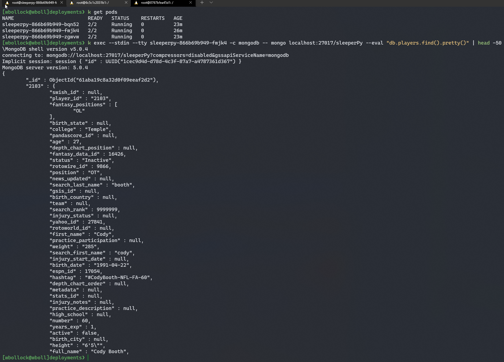
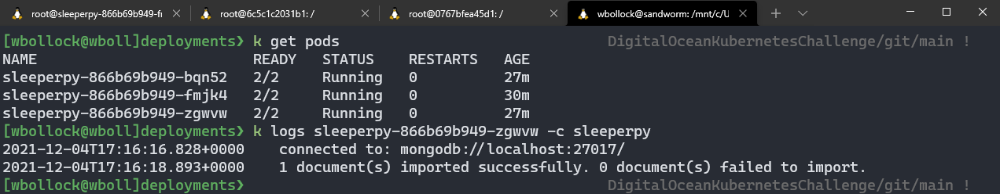

# DigitalOceanKubernetesChallenge

## Purpose

This is a proof of concept deployment of a simple Python stub and MongoDB, intended to showcase containerization of my fantasy football webapp [sleeperPy](https://github.com/wbollock/sleeperPy).

Digital Ocean graciously supported this project with a donation to charity.

A simple Python docker container grabs player data from Sleeper Fantasy Football and imports it into a MongoDB collection. I hope to eventually pair this with a web frontend of Kubernetes use, ideally seperated out into microservices. The current stub would be nice with the Kubernetes CronJob object.

## Usage

Using a `kubeconfig` file from your cloud provider, run the deployment.
```
cd deployments
kubectl apply -f .
``` 

I also used [kompose](https://kompose.io/) to assist with creating the initial deployment file.

To continue development, after changes are made:
```
docker-compose build
docker-compose push
k apply -f deployments/
```

## Challenge walkthrough and writeup

### The deployment process

This is a standard Kubernetes multi-container pod deployment:
```
spec:
  replicas: 3
  selector:
    matchLabels:
      io.kompose.service: sleeperpy
  template:
    metadata:
      annotations:
        kompose.cmd: kompose convert
        kompose.version: 1.26.0 (40646f47)
      creationTimestamp: null
      labels:
        io.kompose.service: sleeperpy
    spec:
      containers:
        - image: wbollock/sleeperpy:latest # my image
          name: sleeperpy
        - image: mongo:latest
          name: mongodb
```

When making changes to our application, all we need to do is run a `docker-compose build` and `docker-compose push` that upload our latest image to Docker Hub. Re-applying the deployment with `k apply -f .` pulls the subsequent upload automatically and does a RollingRestart deploy method.

### The application stub and Docker setup

`import_data.py` is a simple script to pull NFL player data and import it into a MongoDB collection. 
```
with urllib.request.urlopen(url) as url:
        data = json.loads(url.read().decode())
        with open(playersFile, 'w') as f:
            json.dump(data,f)
            f.close()
```

Curiously, I needed to manually install mongodb tools to obtain `mongoimport`, as PyMongo doens't seem to have the ability to import JSON data into a remote database. Perhaps I'm missing something.

```
RUN wget https://fastdl.mongodb.org/tools/db/mongodb-database-tools-debian10-x86_64-100.5.1.deb
RUN apt install ./mongodb-database-tools-debian10-x86_64-100.5.1.deb
```

It's important to note with a multi-container pod setup, `localhost` with actually be the database hostname, not something like the `container_name` in a regular docker-compose setup.


### Displaying data

While eventually a Flask component or similar would be nice to display this data and fully rewrite [sleeperPy](https://github.com/wbollock/sleeperPy) to be container-compatible, for now, here is data from the Kubernetes pods.

I didn't structure this data perfectly, but it's clear that this is a distributed NoSQL deployment.



We're running a `kubectl exec` command here to query data from a single MongoDB container in one pod.

```
 k exec --stdin --tty <one pod> -c mongodb -- mongo localhost:27017/sleeperPy --eval "db.players.find().pretty()" | head -50
```

Lastly, to see what our application is doing, we can query logs for it.



There isn't much to log here, but we can see that we're connecting to `localhost` successfully and importing our document.